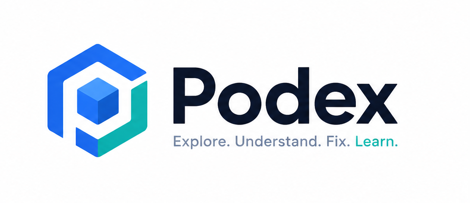

<div align="center">
  
  <br/><br/>
  <h1>Podex Website</h1>
  <p><strong>Landing, marketing, and documentation site for Podex</strong></p>
  <p>A visual Kubernetes playground  explore clusters, design architectures with drag-and-drop, troubleshoot with AI, all from your browser.</p>

  <br/>


  <a href="/docs">Documentation</a>
  &nbsp;&nbsp;·&nbsp;&nbsp;
  <a href="/pricing">Pricing</a>
  &nbsp;&nbsp;·&nbsp;&nbsp;
  <a href="/about">About</a>
  &nbsp;&nbsp;·&nbsp;&nbsp;
  <a href="https://github.com/Hritikraj8804/podex">GitHub</a>

</div>

## About

This is the **Podex Website**  a Next.js 16 (App Router) landing, marketing, and documentation site for the [Podex](https://github.com/Hritikraj8804/podex) desktop application. The actual Podex app codebase is in a [separate repository](https://github.com/Hritikraj8804/podex).

### What is Podex?

Podex is a **local, visual Kubernetes cluster examiner and interactive playground** designed for beginners and students. It transforms cluster administration from a text-heavy terminal experience into an interactive, visual, and AI-toured playground.

## Tech Stack

| Layer | Technology |
|-------|-----------|
| **Framework** | Next.js 16 (App Router) |
| **Styling** | Tailwind CSS v4 |
| **Animations** | Framer Motion |
| **Icons** | Lucide React |
| **Diagrams** | Mermaid |
| **Testing** | Jest + React Testing Library |
| **Font** | Geist (Geist Sans + Geist Mono) |

## Features

| Feature | Description |
|---------|-------------|
| **Visual Dashboard** | Real-time cluster health with gradient hero, color-coded stat cards, Pod Status Matrix, Needs-Attention panel |
| **Cluster Explorer** | Browse 9 resource types  Pods, Deployments, Services, Nodes, ConfigMaps, Secrets, StatefulSets, DaemonSets, Events |
| **Arena Playground** | Drag-and-drop React Flow canvas. Wire K8s blocks together and auto-generate YAML |
| **Topology View** | Dynamic SVG map of resource relationships (Ingress → Service → Deployment → Pod) |
| **Live Log Streaming** | Container logs via SSE with auto-reconnect, configurable tail limits |
| **Interactive Terminal** | WebSocket-powered shell sessions inside any container |
| **Port Forwarding** | One-click port forwarding with PID subprocess management |
| **AI Command Generator** | Describe in plain English → get a ready-to-run kubectl command |
| **AI Concept Tutor** | Ask questions, get real-world analogies and common pitfalls |
| **AI Troubleshooter** | One-click diagnosis  root cause, evidence list, and fix suggestions |

## Quick Start (Development)

```bash
git clone https://github.com/Hritikraj8804/podex.git
cd podex/frontend
npm install
npm run dev
```

Open **http://localhost:3000** in your browser.

## Project Structure

```
src/
├── app/           # Next.js App Router pages
│   ├── about/     # About page
│   ├── docs/      # Documentation (SSG)
│   ├── download/  # Download page
│   ├── pricing/   # Pricing page (it's free)
│   └── layout.tsx # Root layout (navbar, footer, theme provider)
├── components/    # React components
│   ├── home/      # Homepage sections (Hero, Features, HowItWorks, etc.)
│   ├── layout/    # Navbar, Footer, ThemeProvider
│   ├── ui/        # UI primitives (Button, Card, Accordion, etc.)
│   └── illustrations/  # Mockups and illustrations
├── lib/           # Utilities and content data
│   ├── content-data.ts  # Navigation, docs content
│   └── utils.ts         # cn() helper
└── hooks/         # Custom hooks
```

## Content Management

Content is managed via **Obsidian vault** at `C:\SecondBrain` and synced to `public/`:
- **Logo**: `logo-light.png`, `logo-dark.png` (theme-aware)
- **Mascot**: `mascot.png` (Poddy)
- **Screenshots**: `dashboard.jpg`, `explorer.jpg`, `cluster-topolgy.jpg`, `areana.jpg`
- **YAML examples**: `pod ui config.jpg`, `pod yaml config.jpg`
- **Maintainer photos**: `maintainer.png`, `ai maintainer.png`

## Pages

| Route | Description |
|-------|-------------|
| `/` | Homepage  Hero, How It Works, Screenshots, Features, Pricing, FAQ, CTA |
| `/docs` | Documentation with SSG, sidebar navigation, mermaid diagrams, search |
| `/download` | Quick start guide and system requirements |
| `/pricing` | it's free |
| `/about` | About Podex and its maintainers (including the AI) |

## Build

```bash
npm run build    # Production build
npm run dev      # Development server
npm test         # Run tests
```

## License

[MIT License](LICENSE)  free to use, modify, and distribute.
