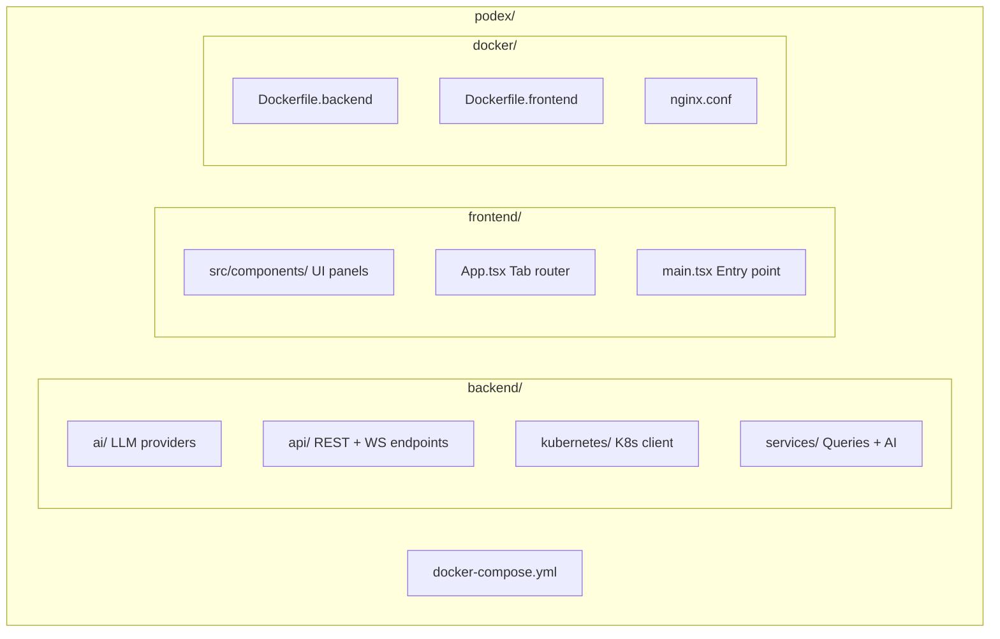

<div align="center">
  <br/>
  <h1>Podex</h1>
  <p><strong>Your Visual Kubernetes Playground</strong></p>
  <p>Explore clusters, design architectures with drag-and-drop, troubleshoot with AI <br/>all from your browser. No terminal required, no YAML headaches.</p>

  <br/>

  <a href="https://github.com/Hritikraj8804/podex/stargazers"></a>
  <a href="https://github.com/Hritikraj8804/podex/blob/main/LICENSE"></a>
  <a href="https://github.com/Hritikraj8804/podex/issues"></a>

  <br/><br/>

  <a href="/download">Get Started</a>
  &nbsp;&nbsp;·&nbsp;&nbsp;
  <a href="/docs">Documentation</a>
  &nbsp;&nbsp;·&nbsp;&nbsp;
  <a href="/features">Features</a>
  &nbsp;&nbsp;·&nbsp;&nbsp;
  <a href="https://github.com/Hritikraj8804/podex">GitHub</a>

  <br/><br/>
</div>

## What is Podex?

Podex is a **local, visual Kubernetes cluster examiner and interactive playground** designed for beginners and students. It transforms cluster administration from a text-heavy terminal experience into an interactive, visual, and AI-toured playground.

### Why Podex?

- **Visual-First**  Drag-and-drop workflow modeling canvas (the Arena) where you wire cards together and see YAML generate dynamically
- **AI-Powered**  LLM-based concepts tutor alongside live resources. Ask *"What is a Service?"* and get analogies based on your live cluster state
- **Zero Setup**  Containerized stack via Docker Compose that connects to any local Kubeconfig. Start in minutes

## Quick Start

```bash
git clone https://github.com/Hritikraj8804/podex.git
cd podex
docker compose up --build
```

Open **http://localhost:5173** in your browser.

> **Prerequisites:** Docker + Docker Compose and a local Kubernetes cluster (Kind, Minikube, or Docker Desktop K8s).

## Features

| Feature | Description |
|---------|-------------|
| **Visual Dashboard** | Real-time health donut chart, metrics counters, namespace filtering |
| **Cluster Explorer** | Interactive tables for Pods, Deployments, Services  with inline scale/restart/delete |
| **Arena Playground** | Drag-and-drop React Flow canvas. Wire K8s blocks together and auto-generate YAML |
| **Topology View** | Dynamic SVG map of resource relationships (Ingress → Service → Deployment → Pod) |
| **Live Log Streaming** | Container logs via SSE with auto-reconnect, configurable tail limits |
| **Interactive Terminal** | WebSocket-powered shell sessions inside any container |
| **AI Concept Tutor** | Ask questions, get real-world analogies and common pitfalls |
| **AI Troubleshooter** | One-click diagnosis  root cause, evidence list, and fix suggestions |

## Architecture

```
Browser / UI
    │
    ▼
React Frontend ──REST/SSE/WS──► FastAPI Backend
                                    │
                                    ├──► Python K8s Client ──► Local Cluster (Kind/Minikube)
                                    │
                                    └──► Gemini / OpenAI API (or Mock fallback)
```

Podex is a **two-tier local daemon** running via Docker Compose:
- **Tier 1:** React (Vite + TypeScript + Tailwind CSS) runs in your browser
- **Tier 2:** FastAPI (Python) proxies requests to your Kubernetes API server

No data leaves your machine. Podex inherits your exact kubectl permissions.



## Tech Stack

| Layer | Technology |
|-------|-----------|
| **Frontend** | React 19, Vite, TypeScript, Tailwind CSS |
| **Backend** | Python, FastAPI, Uvicorn |
| **Kubernetes** | Official python client, KubeConfig auth |
| **AI** | Google Gemini, OpenAI, Mock providers |
| **Containerization** | Docker, Docker Compose |
| **Monitoring** | Prometheus, Grafana (optional) |

## Contributing

We welcome contributions from developers of all experience levels.

1. Set up a local Kind cluster: `kind create cluster --name podex`
2. Clone the repo and follow the [Quick Start](#quick-start)
3. Open issues for bugs or feature requests
4. Submit PRs for review

**Areas to help:** Unit tests (pytest + vitest), documentation, integration tests, and new features listed in the [roadmap](/docs/installation#roadmap).

## Community

- 🐛 [Issues](https://github.com/Hritikraj8804/podex/issues)  Report bugs or request features
- 💬 [Discussions](https://github.com/Hritikraj8804/podex/discussions)  Ask questions and share ideas
- ⭐ [Star the repo](https://github.com/Hritikraj8804/podex)  Show your support

## License

[MIT License](LICENSE)  free to use, modify, and distribute.
